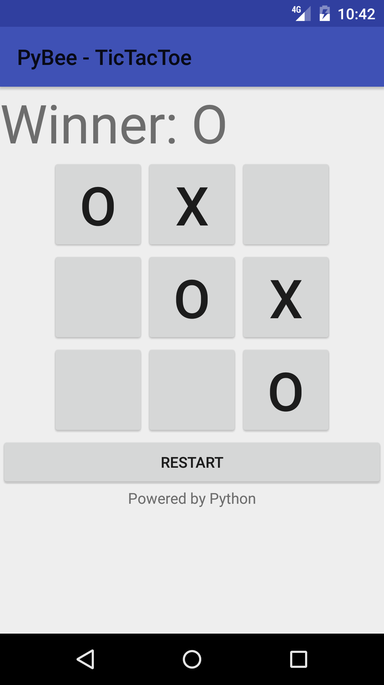

Tic Tac Toe
===========

This is a native Android app written in Python, using the [BeeWare](http://pybee.org/) suite.

The Python code is compiled to Java bytecode using [VOC](http://pybee.org/voc),
and the Android APK is packaged using [briefcase](https://github.com/pybee/briefcase).

**Requirements**

* JDK
* Android SDK

## How to run

Ensure that you have [Android SDK](https://developer.android.com/studio/index.html#downloads) installed.

Install the Python development requirements:

    pip install -r requirements-dev.txt

[Plug in your Android device](https://developer.android.com/training/basics/firstapp/running-app.html) or [start an emulator](https://developer.android.com/studio/run/emulator-commandline.html).

Build and run the app:

    python setup.py android
    (cd android && ./gradlew run)

## Want to know more?

If you liked this, you might like:

* [Native Android drawing app written in Python](https://github.com/eliasdorneles/drawingapp-voc)
* [Template for native Android apps written in Python](https://github.com/eliasdorneles/beeware-android-template)
* [Video of a talk explaining how VOC works](https://www.youtube.com/watch?v=9c4DEYIXYCM)
